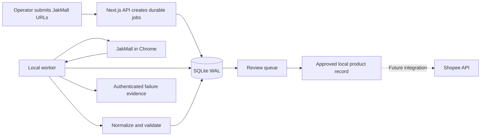

# CatalogBridge

CatalogBridge is a local operations application for turning JakMall product pages into structured, reviewable catalog records. It extracts supplier data, applies deterministic pricing rules, flags uncertain fields, and gives an operator a controlled workflow for reviewing products before any marketplace integration is added.

The repository is named **Jak2Shopee**. The application itself is called **CatalogBridge**.

> **Project status:** The Stage 1 local extraction and review workflow is operational. Shopee authentication and publishing are not implemented; publisher mode is intentionally fixed to dry run.

## What CatalogBridge does

- Accepts one or as many as 20 HTTPS JakMall product URLs per import.
- Extracts titles, descriptions, seller SKUs, prices, images, weights, variants, attributes, and visible stock information.
- Normalizes storefront text and applies configurable markup, minimum-margin, buffer, and rounding rules.
- Persists imports, products, job events, settings, and worker heartbeats in SQLite.
- Sends uncertain records to a review queue instead of silently guessing operational fields.
- Supports product editing, authenticated CSV export, source refresh, and deletion with confirmation.
- Provides searchable processing history with live status, retries, cancellation, duplicate resolution, and failure evidence.
- Includes responsive desktop and mobile layouts, English and Indonesian text, notifications, and a collapsible navigation sidebar.

## Current capability status

| Capability | Status |
| --- | --- |
| JakMall single and batch imports | Implemented |
| Background extraction worker | Implemented |
| Product normalization and pricing rules | Implemented |
| Human review workflow | Implemented |
| Job retry, cancellation, evidence, and duplicate handling | Implemented |
| Persistent workspace settings | Implemented |
| Shopee authentication and catalog mapping | Planned |
| Live Shopee publishing | Not implemented |
| Multi-user or multi-instance deployment | Not implemented |

## Workflow



The web application and extraction worker are separate processes. The web application creates jobs and displays their state; the worker claims queued jobs, runs extraction, and writes results and event history back to the same database.

## Data accuracy and stock handling

CatalogBridge preserves an exact stock number only when JakMall exposes one, including labels such as `Stok Tinggal 5` and `Stok Sisa 5`. Some pages expose only `Stok Tersedia`, which confirms availability but does not disclose a quantity.

The current product schema still requires an integer stock value. Availability-only pages therefore receive a provisional value together with an `Exact stock quantity needs confirmation` warning. Operators must review that value before using the record. A planned schema change will separate:

- source availability: available, unavailable, or unknown;
- nullable source quantity; and
- operator-defined Shopee listing stock.

Prices, descriptions, and other fields can also change when JakMall changes its page structure. Parser warnings and extraction evidence are part of the product record for this reason. **Refresh from JakMall** re-extracts a product in place while preserving its destination category.

## Technology

| Layer | Implementation |
| --- | --- |
| Web application | Next.js 16 App Router and React 19 |
| Language | TypeScript |
| Interface | Tailwind CSS 4, shadcn/ui, and Radix UI |
| Validation | Zod |
| HTML parsing | Cheerio |
| Browser extraction | Playwright Core with local Chrome |
| Persistence | Node SQLite in WAL mode |
| Tests | Node test runner |

## Requirements

- Node.js 24.x, which is used to run the TypeScript worker directly.
- npm.
- Google Chrome, or another compatible Chromium executable supplied through `CATALOGBRIDGE_CHROME_PATH`.

## Local setup

Clone the public repository and install its locked dependencies:

```bash
git clone https://github.com/Richmiz/Jak2Shopee.git
cd Jak2Shopee
npm ci
npm run db:init
```

Copy the environment template:

```powershell
Copy-Item .env.example .env.local
```

Run the web application and worker in separate terminals:

```bash
npm run dev
```

```bash
npm run worker
```

Open [http://localhost:3000](http://localhost:3000).

When authentication variables are omitted in development, any valid email and a password of at least six characters can enter the local workspace. Production sign-in fails closed unless all required authentication variables are configured.

## Authentication configuration

CatalogBridge currently uses one operator account configured through environment variables. It has no public signup flow.

| Variable | Purpose |
| --- | --- |
| `AUTH_SECRET` | Secret used to sign session cookies; use at least 32 random bytes. |
| `AUTH_EMAIL` | Email address allowed to sign in. |
| `AUTH_PASSWORD_HASH` | PBKDF2-SHA256 password hash in `iterations:salt:hash` format. |

Generate a session secret:

```bash
node -e "console.log(require('node:crypto').randomBytes(32).toString('hex'))"
```

Generate a password hash:

```bash
node -e "const c=require('node:crypto');const s=c.randomBytes(16).toString('hex');const i=210000;console.log(i+':'+s+':'+c.pbkdf2Sync(process.argv[1],s,i,32,'sha256').toString('hex'))" "replace-with-your-password"
```

Session cookies are signed, HttpOnly, SameSite=Lax, and Secure in production. New sessions use the timeout configured in the Settings screen.

## Runtime configuration

Start from [`.env.example`](./.env.example). Supported runtime variables include:

| Variable | Default | Description |
| --- | --- | --- |
| `CATALOGBRIDGE_DB_PATH` | `./data/catalogbridge.db` | SQLite database path. |
| `CATALOGBRIDGE_BROWSER_MODE` | `adaptive` | Browser behavior: `adaptive`, `headless`, or `visible`. |
| `CATALOGBRIDGE_BROWSER_PROFILE` | `./data/browser-profile` | Persistent Chrome profile used by the worker. |
| `CATALOGBRIDGE_EVIDENCE_PATH` | `./data/evidence` | Local directory for bounded failure screenshots. |
| `CATALOGBRIDGE_CHROME_CHANNEL` | `chrome` | Playwright browser channel. |
| `CATALOGBRIDGE_CHROME_PATH` | unset | Optional explicit Chromium executable path. |
| `CATALOGBRIDGE_VERIFICATION_TIMEOUT_MS` | `120000` | Time allowed for operator verification. |
| `CATALOGBRIDGE_WORKER_POLL_MS` | `1500` | Delay between empty-queue checks. |

Pricing, retries, image validation, duplicate detection, review requirements, job concurrency, browser timeout, and session timeout are managed from the Settings screen and persisted in SQLite. Updated settings apply to newly queued jobs; a changed session timeout applies to newly issued sessions.

### Browser modes

| Mode | Behavior |
| --- | --- |
| `adaptive` | Runs normal extraction in the background and opens one temporary Chrome window only when JakMall requests legitimate human verification. |
| `headless` | Keeps Chrome headless and permits the configured concurrency of up to three isolated worker profiles. Human verification cannot be completed in this mode. |
| `visible` | Runs extraction in a visible Chrome window and serializes jobs. |

CatalogBridge does not solve or bypass CAPTCHA, 2FA, or access-control challenges. When human verification is allowed, the operator completes it directly and extraction resumes afterward.

## Project commands

| Command | Purpose |
| --- | --- |
| `npm run dev` | Start the Next.js development server. |
| `npm run worker` | Run the local extraction worker continuously. |
| `npm run worker:once` | Process at most one queued job and exit. |
| `npm run db:init` | Initialize or migrate the local database. |
| `npm test` | Run parser, pricing, and persistence tests. |
| `npm run lint` | Run ESLint. |
| `npm run build` | Create and type-check a production build. |
| `npm start` | Start a previously built Next.js application. |

## Repository structure

```text
src/
├── app/                       Next.js routes, API handlers, and authentication actions
├── components/                Application screens and shadcn-based UI components
├── lib/                       Shared presentation and pricing utilities
├── server/
│   ├── catalog-store.mts      SQLite schema, migrations, and repository operations
│   ├── catalog-types.mts      Validation schemas and domain types
│   └── extraction/            JakMall browser extraction and normalization
├── db-init.mts                Database initialization entry point
└── worker.mts                 Durable local job worker
tests/                         Parser, pricing, and store regression tests
docs/                          Original project blueprint and UI reference material
data/                          Local database, browser profile, and evidence; ignored by Git
```

## Verification

Before opening a pull request or deploying a build, run:

```bash
npm test
npm run lint
npm run build
npm run worker:once
```

Tests use local fixtures and do not require live JakMall access. A successful `worker:once` run confirms that the worker runtime can start, but it does not make a live extraction when the queue is empty.

## Deployment notes

The current architecture requires:

- a persistent writable filesystem for SQLite, browser profiles, and evidence;
- a long-running Next.js process;
- a separate long-running worker process; and
- local Chrome or Chromium access for extraction.

A Node-capable VPS or dedicated Hostinger environment can meet these requirements when both processes are supervised with a service manager such as systemd or PM2. Typical shared hosting and a Vercel-only serverless deployment cannot run the current long-lived browser worker or safely share its local SQLite database.

Before multi-user or multi-instance deployment, replace SQLite and local evidence storage with shared services such as PostgreSQL and object storage. Add centralized logging, backups, health monitoring, and a production identity provider at the same time.

## Security and responsible use

- Only HTTPS URLs on `jakmall.com` and its subdomains are accepted.
- Authentication secrets and runtime data are excluded from Git.
- Failure evidence is served through authenticated application routes and remains local by default.
- The worker pauses or fails safely when a page requires verification; it does not bypass access controls.
- Operators are responsible for complying with JakMall and Shopee terms, applicable laws, and product-data usage rights.

CatalogBridge is an independent project and is not affiliated with, endorsed by, or sponsored by JakMall or Shopee.

If you discover a security issue, do not publish credentials, session material, private product data, or a working exploit in a public issue. Contact the repository owner privately.

## Roadmap

1. Separate source availability, nullable source quantity, and destination listing stock.
2. Add Shopee authentication and seller-account connection handling.
3. Implement Shopee category, attribute, variant, image, and pricing mappings.
4. Add an explicit publish confirmation flow with idempotency and audit evidence.
5. Move production persistence to PostgreSQL and object storage.
6. Add invitation-based multi-operator authentication, end-to-end tests, accessibility checks, backups, and observability.

## Contributing

Focused bug reports and pull requests are welcome. Keep extraction behavior evidence-based: do not turn ambiguous source text into authoritative product values, bypass human verification, or report Shopee publishing as complete while publisher mode remains dry run. Include regression coverage for parser and persistence changes.

## License

No open-source license has been added yet. The repository is publicly visible, but its contents are not licensed for redistribution, modification, or commercial use unless the repository owner grants permission or adds a license.
